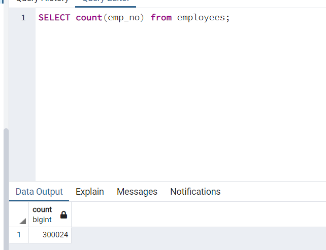
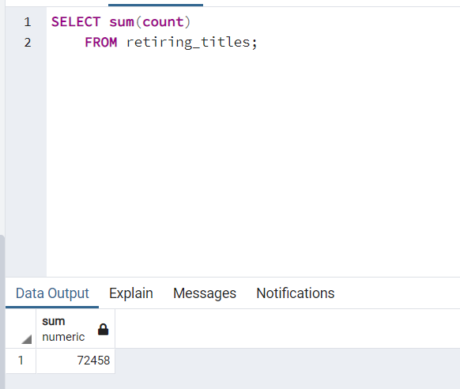
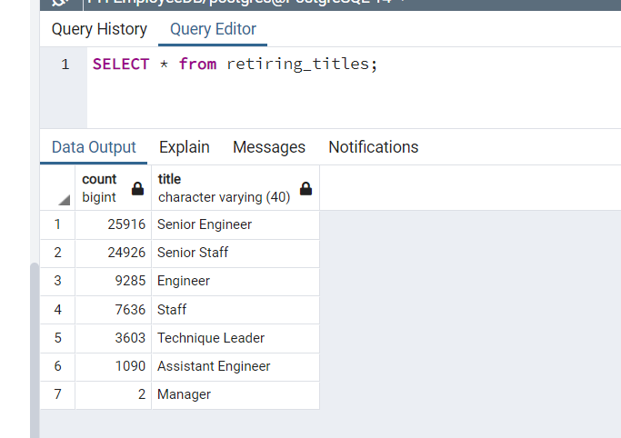
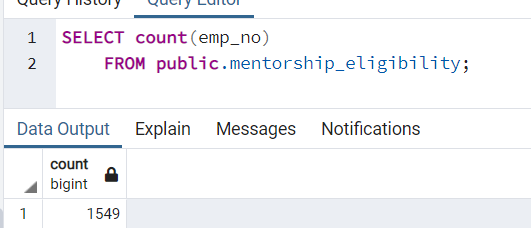
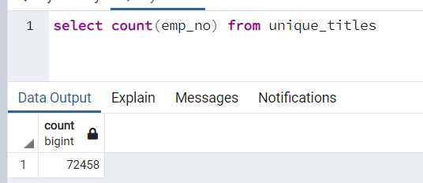
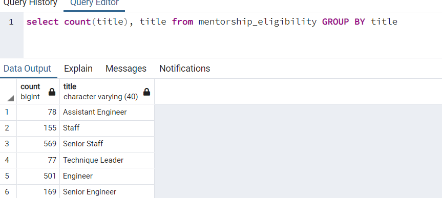

# Pewlett-Hackard-Analysis
## Overview
The purpose of this analysis was to determine the gaps in the company employee databases to identify where the company would need to hire new employees. The reason for this was because a large majority of the company was retiring, so we created three tables: unique employee titles, retiring employee titles, and titles that are eligible for mentoring newer employees.

## Results
* **Total Employees vs Total Employees Retiring**

    The first thing that we notice with this analysis is how many employees are retiring from this company. In total the company has 300024 current employees. We can find this by using the code shown below, and using the count aggregate on our emp_no column.

    

    In total the number of retiring employees is 72,458 calculated by grabbing the sum of our count column from the retiring titles table as seen below. This results in 24% of the total employees leaving due to retirement.
    
* **Titles of Employees Retiring**

    Using that same table, retiring_titles, we can also grab the count of the employees that we will n eed to hire in order to replace those that are leaving. 

    

    Here we see that we will need to start with replacing Senior Engineers, then Senior Staff, then Engineers, then Staff, then Technique Leaders, then Assistant Engineers, then Managers. 

* **Number of Mentors**
    The next thing that we need to discuss is the number of employees that are eligible to be a mentor. These are individuals that born in 1965 that are capable of becoming mentors, for newer employees. 
    Below, we see that there are 1,549 eligible to be mentors. 

    

    The difference here being that these are individuals that are not going to be retiring so they will  be in the current_emp table.

* **Unique Titles**

    We need to call out the number of employees that are retiring, but focus on their most recent title, rather than all of their titles. To do this, we select the distinct employee number so that we only see 1 of an employee as seen below.
 
     

     This results in only 1 case of an employee, whereas our previous iteration of the retiring employee titles would result in all of the titles an employee had
## Summary
### How many roles will need to be filled as the "silver tsunami" begins to make an impact?

The total number of roles that need to be filled can be calculated by grabbing the count of retiring employees from the unique titles table in our database. After we run the code below, we see that our output is around 72,000 total employees.

### Are there enough qualified, retirement-ready employees in the departments to mentor the next generation of Pewlett Hackard employees?

In order for us to determine if there are enough retirement-ready employees in the departments to mentor we need to know how many employees we have that are mentor ready.

Here we see that there are 1,549 total mentors but we have 72,458 total employees retiring in the "silver tsunami". That means that each mentor would need to teach around 46 mentees.

### Additional Query 1

The first query that I would suggest using is the breakdown of which mentors exist in which department, and how many. To calculate this we use the code below 

From the above we can see that 569 of our mentors are staff engineers, 501 are engineers, 169 are senior engineers, 155 are staff, 78 are assistant engineers, and 77 are technique leaders. This provides valueable insight into what areas we can utilize the most mentors, and to which ones need more.

### Additional Query 2 

The second query that I would suggest using is the number of retiring employees per department. This would tell me which areas in the organization would be losing the most employees so that the company is aware and may allow that area to have less business. For example, if marketing has less employees, maybe instead of 4 campaigns per month, they run 2.
